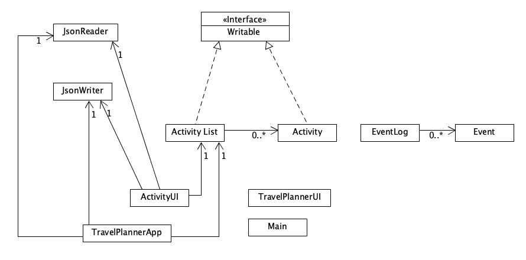

# Travel Planner

**Travel Planner** is a desktop application designed to assist people in planning their trips. 
It allows users to add activities, keep track of their plans and make changes during their trip.
Users seeking a well-organized trip can utilize this application to achieve their goals.

I enjoy creating plans, especially for activities that involve a lot of uncertainty, such as traveling.
Therefore, I am highly interested in designing an app that enhances people's travel experiences 
by aiding them in creating comprehensive travel plans.

## User Stories

- As a user, I want to be able to add one or multiple activities on my travel planner.
- As a user, I want to be able to delete one or multiple activities on my travel planner.
- As a user, I want to be able to add or reduce the number of hours I spend on each activity.
- As a user, I want to be able to view total number of hours I spend on all activities.
- As a user, I want to be able to view a list of activities in the same location. 
- As a user, I want to be able to save my travel planner to file.
- As a user, I want to be able to load my travel planner from file.

## UML

